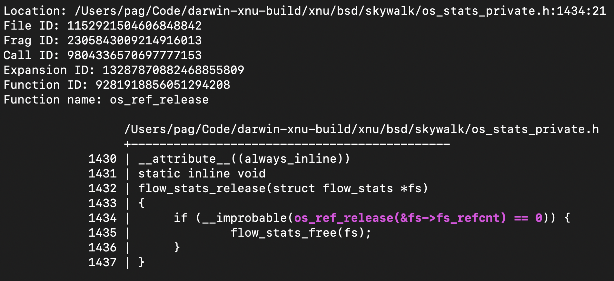

# `mx-find-calls-in-macro-expansions`

This tool finds calls to functions where the calls themselves are expressed as
explicit arguments to the top-level macro use.

```shell
% mx-find-calls-in-macro-expansions --db /tmp/xnu.db
```

Here is an examples of its output:


