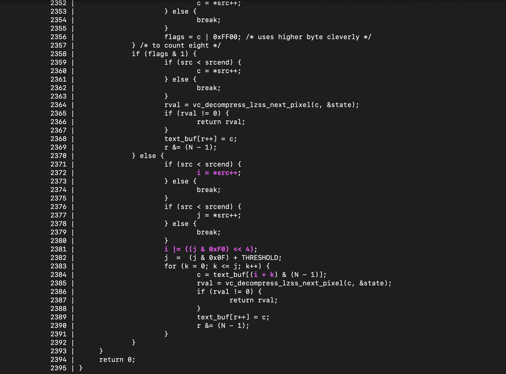

# `mx-find-divergent-candidates`

This tool performs a variant analysis to locate possible [divergent representations](https://blog.trailofbits.com/2022/11/10/divergent-representations-variable-overflows-c-compiler).

```shell
% mx-find-divergent-candidates --db /tmp/xnu.db --show_locations
```

The `--show_locations` option should probably always be used so that the relevant
code fragment is rendered. And example of one of the outputs is:


