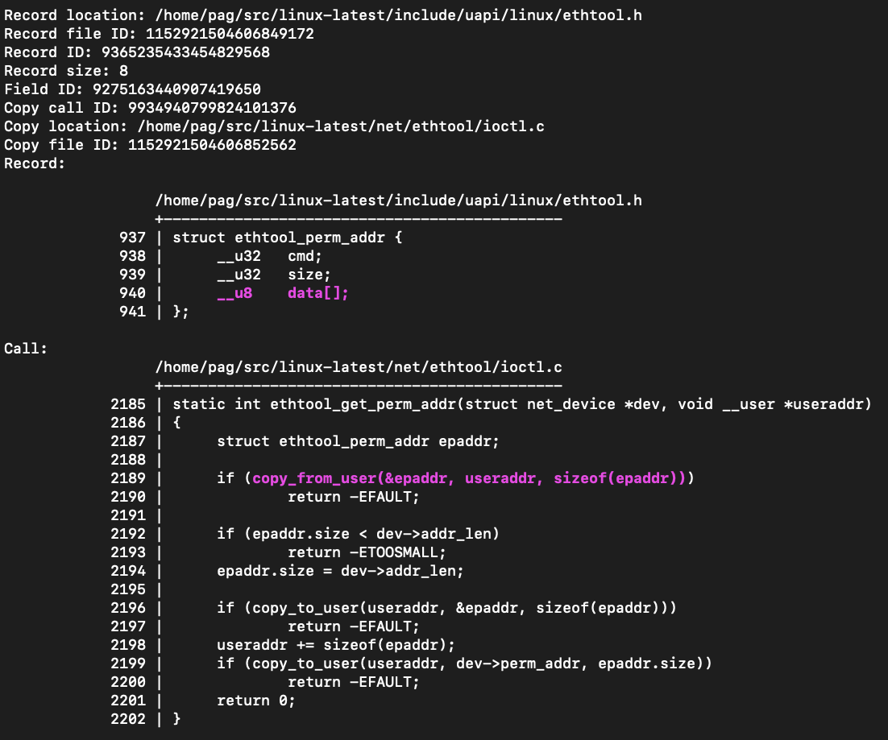

# `mx-find-flexible-user-copies`

This tool is tailored to the Linux kernel. It looks for the `copy_from_user` function in the Linux kernel, and then finds calls to that function that write into variables whose type is a “flexible structure.” A [flexible structure](https://en.wikipedia.org/wiki/Flexible_array_member) is one that ends with an array-typed field with zero-size, or an unspecified size. For example:

```shell
% mx-find-flexible-user-copies --db /tmp/linux.db
```

And one of the outputs is:



These can be interesting to inspect because the flexible member often requires additional follow-up `copy_from_user` calls, and these subsequent calls may be subject to [TOCTOU](https://en.wikipedia.org/wiki/Time-of-check_to_time-of-use) issues.
