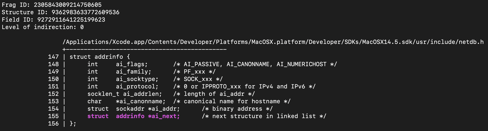
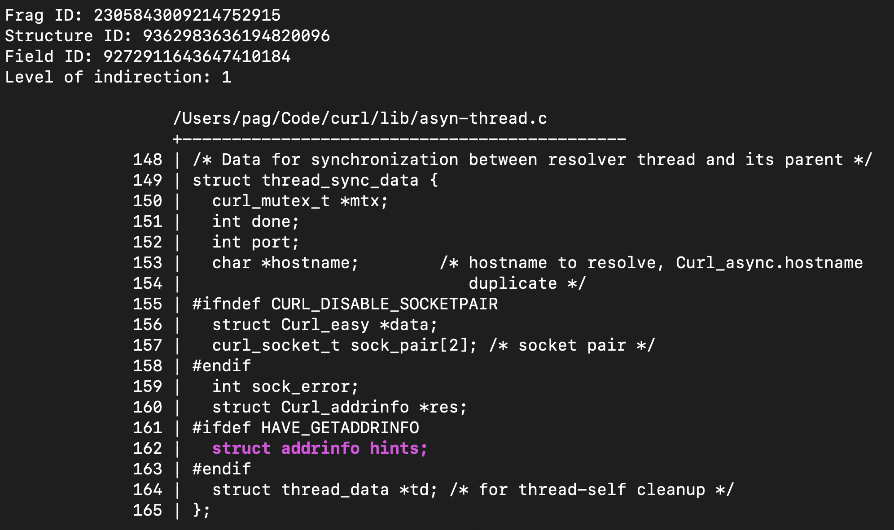
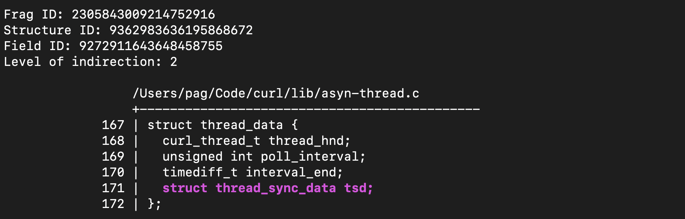

# `mx-find-linked-structures`

Sometimes you want to find data structures that link to themselves, such as linked lists and trees. This tool identifies those as "level 0" results, then finds instances of them directly embedded within other data structures. This is a common pattern in the Linux kernel. For example, `struct list_head` is a level 0 intrusive linked list data structure that is often embedded inside of other data structures.

```shell
% mx-find-linked-structures --db /tmp/curl.db
```

Here are some examples of its outputs:






