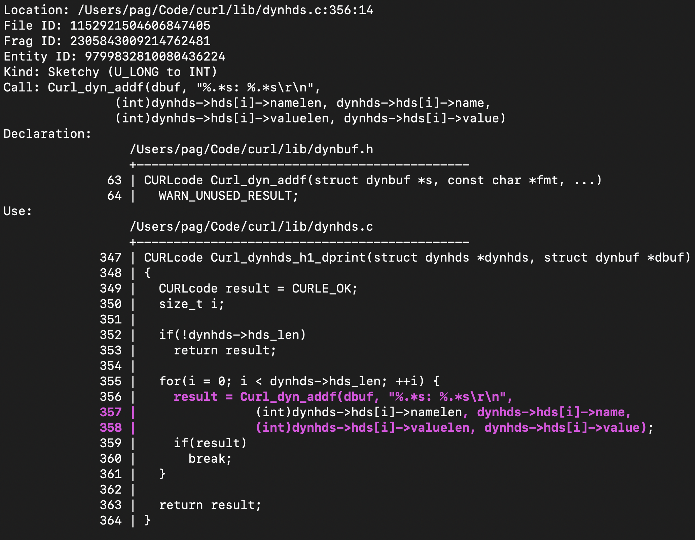

# `mx-find-sketchy-casts`

This tool focuses on finding "sketchy" integral type conversions happening in function call arguments, or with the return values at call sites. A "skeychy" cast is one that potentially loses information, or changes the signedness interpretation of the data. There are a few options that configure its behavior, so be sure to consult the `--help` option.

```shell
% mx-find-sketchy-casts --db /tmp/curl.db --show_explicit
```

Here is one of the outputs:



In the above example, the entire call is highlighted in purple, and the sketchy part is left unhighlighted. When a sketchy return is discovered, the user of the call, e.g. the assignment of the return value to a variable, is highlighted in purple, while the call is left unhighlighted. We asked for an explicit sketchy cast, and we see that the Kind: is telling us that it’s `U_LONG` to `INT`, i.e. that `namelenlen` is an `unsigned long`, and that `(int)` is an explicit cast to int.
