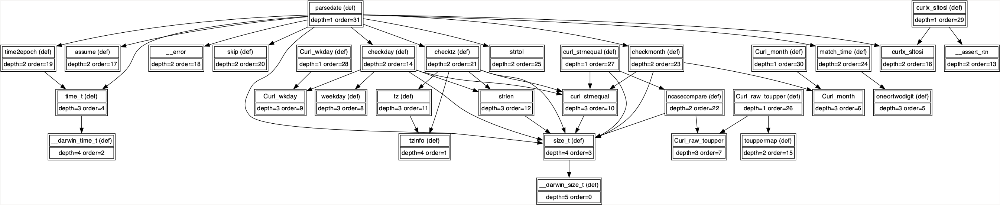

# `mx-harness`

This tool helps users develop fuzzer harnesses and shellcode. The challenge that this tool solves is that the target program might not be traditionally harnessable. For example, it might not be safe to compile-in a harness and run the program. Similarly, the user might be using the SDK on one platform (e.g. Linux), whereas the target was developed and indexed on another platform (e.g. macOS). Finally, if the target is firmware or an operating system kernel, then the problem faced by a user might be as simple as how to invoke their harness. `mx-harness`'s solution is to extract relevant code from the target, and produce a compilable artifact that can be used directly.

Given a target entity (usually a function), this tool will transitively extract, sort, and output all code that the target entity relies upon. Usually the output is compilable, and when it isn't, generally only small modifications are needed. There are two outputs. A [DOT digraph](https://graphviz.org/doc/info/lang.html) of dependencies is outputted to `stderr`, mostly for debugging purposes. Source code is outputted to `stdout`, and includes comments about its provenance. Here's an example of how to use the tool:

```shell
% mx-harness --db /tmp/curl.db --entity_name parsedate 2>/dev/null
```

Here, we've passed in `parsedate` as the function from cURL to harness. We've given it by name, but we could have been more precise and given an `--entity_id` instead. `stderr` has been sent to `/dev/null` so it doesn't get in the way. The output starts like this:

```c
// Skipping fragment 2305843009214750187: __builtin_expect
struct tzinfo;
// Fragment ID: 2305843009214743593
// File ID: 1152921504606847122
// File path: /Applications/Xcode.app/Contents/Developer/Platforms/MacOSX.platform/Developer/SDKs/MacOSX14.5.sdk/usr/include/arm/_types.h
// Line: 70
// Column: 1
typedef   long unsigned int             __darwin_size_t ;

// Fragment ID: 2305843009214772059
// File ID: 1152921504606847588
// File path: /Users/pag/Code/curl/lib/parsedate.c
// Line: 120
// Column: 1
struct   tzinfo   { 
    char   name [ 5 ] ; 
    int   offset ;   /* +/- in minutes */ 
 } ;

...
```

And goes on to eventually end like this:

```c
// Fragment ID: 2305843009214772056
// File ID: 1152921504606847588
// File path: /Users/pag/Code/curl/lib/parsedate.c
// Line: 110
// Column: 1
const   char   *   const   Curl_month [ ] = 
 {   "Jan" ,   "Feb" ,   "Mar" ,   "Apr" ,   "May" ,   "Jun" , 
    "Jul" ,   "Aug" ,   "Sep" ,   "Oct" ,   "Nov" ,   "Dec"   } ;

// Fragment ID: 2305843009214772082
// File ID: 1152921504606847588
// File path: /Users/pag/Code/curl/lib/parsedate.c
// Line: 357
// Column: 1
static   int   parsedate ( const   char   * date ,   time_t   * output ) 
 { 
    time_t   t   =   0 ; 
    int   wdaynum   =   - 1 ;    /* day of the week number, 0-6 (mon-sun) */ 
    int   monnum   =   - 1 ;     /* month of the year number, 0-11 */ 
    int   mdaynum   =   - 1 ;   /* day of month, 1 - 31 */ 
    int   hournum   =   - 1 ; 
    int   minnum   =   - 1 ; 
    int   secnum   =   - 1 ; 
    int   yearnum   =   - 1 ; 
    int   tzoff   =   - 1 ; 
    enum   assume   dignext   =   DATE_MDAY ; 
    const   char   * indate   =   date ;   /* save the original pointer */ 
    int   part   =   0 ;   /* max 6 parts */ 

    while ( * date   &&   ( part   <   6 ) )   {
...
```

What we can observe is that it goes all the way back to platform-specific type definitions. The harnessed function, `parsedate`, isn’t necessarily the last thing in the output. Using `xdot` on the output from `stderr`, we can see the following:



Again, this DOT format is mostly for debugging purposes. 

If you need to edit the source code outputted to `stdout`, or intend to read it, then I recommend saving the output to a file, then running [`clang-format`](https://clang.llvm.org/docs/ClangFormat.html) on that file.

Let’s save the output to a file and check if it’s compilable!

```shell
% mx-harness --db /tmp/curl.db --entity_name parsedate >/tmp/test.c 2>/dev/null
% clang -fsyntax-only /tmp/test.c
```

And yes, it is, because no errors are reported.
