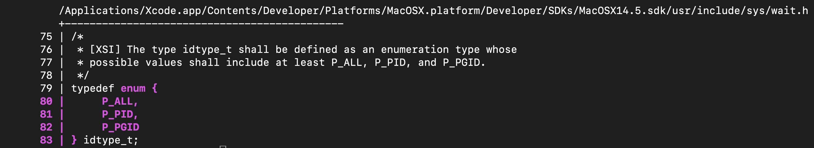

# `mx-highlight-entity`
We can use the `mx-highlight-entity` to show us the code associated an entity.
For example:

```shell
% mx-list-structures --db /tmp/curl.db
...
1152921504606847021 2305843009214747660 9266156238696087552 idtype_t::(anonymous enum)
    9263904438882402304 P_ALL
    9263904438882402305 P_PID
    9263904438882402306 P_PGID
...
```

Above, we see that the entity `9266156238696087552` is an anonymous enum inside
of `idtype_t`. Using `mx-highlight-entity`, we can better see what this looks
like:

```shell
% mx-highlight-entity --db /tmp/curl.db --entity_id 9266156238696087552
```

The output is as follows:



This structure is an anonymous `enum` defined in the declarator of a `typedef`
named `idtype_t`.
