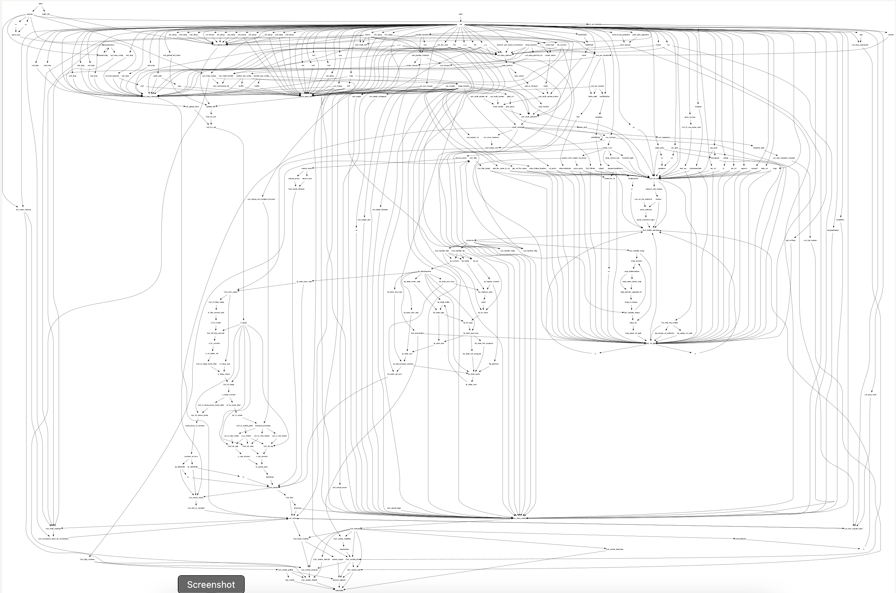
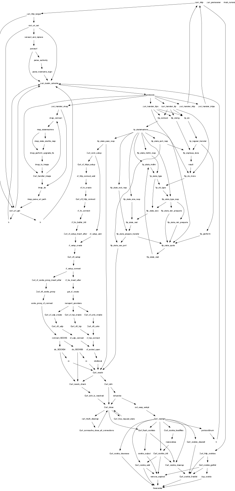

# `mx-print-call-graph`

This tool takes in an `--entity_id <entity_id>`, typically the ID of a function,
and prints a [DOT digraph](https://graphviz.org/doc/info/lang.html) of all
transitive callers of the function. For example:

```shell
% mx-list-functions --db /tmp/curl.db | grep freecookie
1152921504606847273 2305843009214753862 9281918843895152640 freecookie  def
```

```shell
% mx-print-call-graph --db /tmp/curl.db --entity_id 9281918843895152640 >/tmp/test.dot
% xdot /tmp/test.dot
```

This can produce giant graphs.



Sometimes, you want to know how to get from point A to point B. There is an
option for this, `--reachable_from_entity_id <from_entity_id>`. This finds the
call graph leading to `--entity_id <to_entity_id>` that is transitively
reachable from the entity with ID `<from_entity_id>`. Here’s an example:

```shell
% mx-list-functions --db /tmp/curl.db | grep cf_setup_connect
1152921504606847266 2305843009214753742 9281918843769323520 cf_setup_connect  def
```

```shell
% mx-print-call-graph --db /tmp/curl.db --entity_id 9281918843895152640 --reachable_from_entity_id 9281918843769323520 >/tmp/test.dot
% xdot /tmp/test.dot
```

This produces a marginally more manageable graph:


