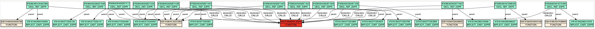
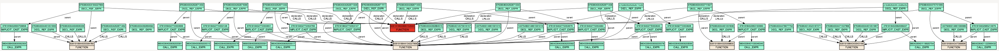
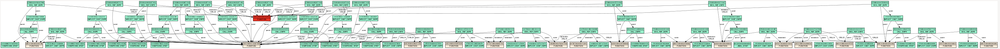

# `mx-print-reference-graph`

This tool prints out the reference and parentage graphs, formatted as
[DOT digraphs](https://graphviz.org/doc/info/lang.html), up to a specified
depth. These graphs can be helpful when understanding Multiplier's reference
format, which is a 4-tuple of `(<from>, <kind>, <to>, <context>)`, and where
by default, `<from>`, `<to>`, and `<context>` are IDs of declarations,
statements, etc., as opposed to IDs of specific tokens.

```shell
% mx-list-functions --db /tmp/curl.db | grep freecookie
1152921504606847273 2305843009214753862 9281918843895152640 freecookie  def
```

```
% mx-print-reference-graph --db /tmp/curl.db --entity_id 9281918843895152640 >/tmp/test.dot
```

This produces a reference graph of length 2, i.e. with one node and all of its
immediated referers.



If we specify `--length 3`, then we get:



If we specify `--length 4`, then we get:



Etc.