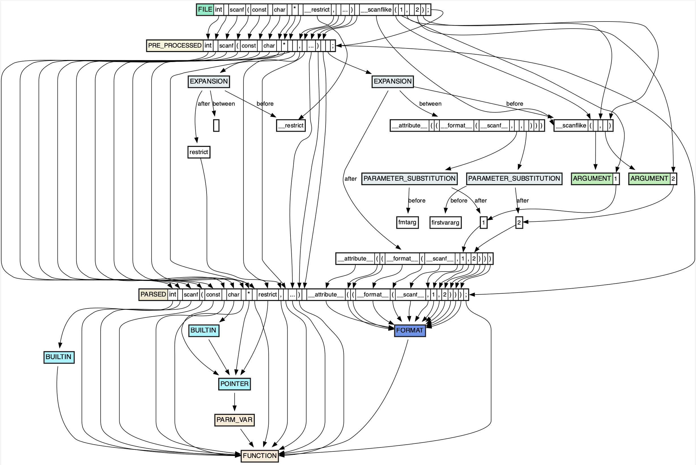

# `mx-print-token-graph`

This tools helps to visualize the relationship between different types of tokens:

* **Parsed tokens**, which are directly referenced by `Decls`, `Stmts`, `Attrs`, etc. These are the tokens that make it to the parsing and semantic analysis phases of the compiler. Whitespace and comments are represented in parsed tokens that are not a result of macro expansion.
* **Macro tokens**, which are directly referenced by `Macro`s. These are the tokens that are interpreted by the C preprocessor. There is a one-to-one relationship between the "final remaining" macro tokens after the pre-processing step and parsed tokens. Whitespace is not represented in macro tokens.
* **File tokens**, which are the tokens that are present in a source file, whitespace and comments included. These are directly referenced by `File`s.

There is one more category of tokens, **type tokens**, which are referenced by `Type` entities. `Type`s are more ephemeral than other entities in Multiplier; however, it's valuable to be able to print them, and so all `Type` entities have corresponding tokens representing their printable form.

This tool is also valuable at showing how, given a `Token`, one can find their way back into the AST using a feature called `TokenContext`s. Mostly, though, the output of this tool helps to reify various connections between entities in Multiplier's data model. Anyway, let's get back to the tool. First, we'll get a list of interesting functions and their corresponding fragments:

```shell
% ./bin/mx-list-functions --db /tmp/curl.db | grep scanf           
1152921504606847034 2305843009214747321 9475573621013348352 fscanf  decl
1152921504606847034 2305843009214747339 9475573621032222720 scanf decl
1152921504606847034 2305843009214747345 9475573621038514176 sscanf  decl
1152921504606847034 2305843009214747377 9475573621072068608 __svfscanf  decl
1152921504606847034 2305843009214747407 9475573621103525888 vfscanf decl
1152921504606847034 2305843009214747408 9475573621104574464 vscanf  decl
1152921504606847034 2305843009214747412 9475573621108768768 vsscanf decl
1152921504606847464 2305843009214764555 9475573639084507136 ber_scanf decl
```

We'll use the fragment ID, `2305843009214747339`, for `scanf` from the second column of the above output. I chose `scanf` because it usually has a macro associated with it, marking it as a "`scanf`-like function". Then, we copy this fragment ID, and run `mx-print-token-graph`:

```shell
% mx-print-token-graph --db /tmp/curl.db --fragment_id 2305843009214747339 >/tmp/test.dot
% xdot /tmp/test.dot
```

The output is a [DOT digraph](https://graphviz.org/doc/info/lang.html), which rendered looks as follows:



There are options to add additional data to the graphs, but it makes them less readable. These options are:

* `--with_categories`: Shows the token categories (these are useful for syntax highlighting).
* `--with_related_entity_ids`: Shows the related entity IDs built in for each token. These are *not* [references](mx-print-reference-graph.md), but are instead embedded by the indexer when saving the tokens to the database. These built-in related entity IDs are used to make "clickable" tokens.
* `--with_token_offsets`: This is for debugging.
