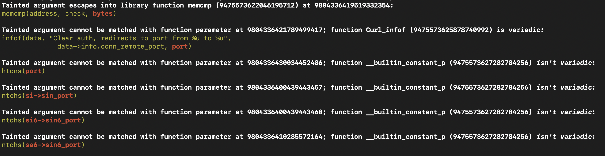
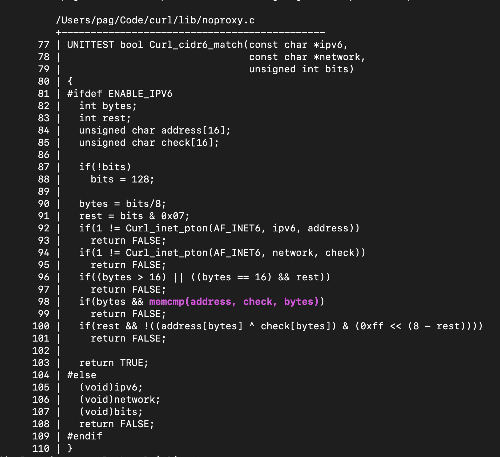
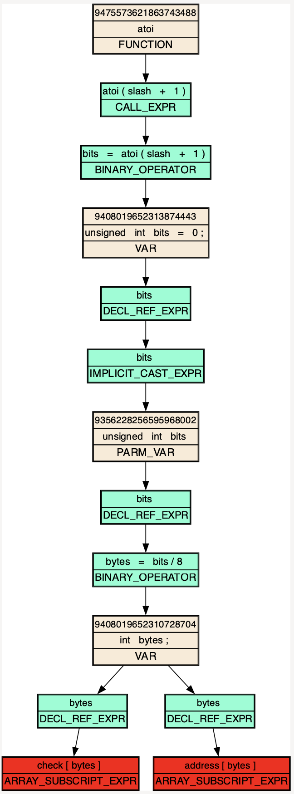

# `mx-taint-entity`

This is a fun tool, though it is under-approximate and not context-sensitive, so its results must be carefully checked. The tool outputs a log of what it doesn't know how to handle to `stderr`, and a [DOT digraph](https://graphviz.org/doc/info/lang.html) to `stdout`. As its input, it takes either an `--entity_id <ID>` or `--entity_name <name>` parameter. For example, if you tell it to taint a function, then it will look at all call sites, and taint the values returned. Similarly, if you ask it to taint a variable, or a field, or even an enumerator, then it will taint all uses of those entities, and propagate the taint from there. The stopping condition for taint propagation is some kind of memory access, e.g. `blah[tainted]`, `*tainted`, or `tainted->blah`. Here is a fun example from cURL:

```shell
% mx-taint-entity --db /tmp/curl.db --entity_name atoi >/tmp/test.dot
```

The output printed to stderr looks like this, and goes on for a bit. It can be worth it to inspect so that you know where the false-negatives are.



The first unhandled statement actually seems interesting, i.e. it seems that we can control the size of a `memcmp`. You can use the [`mx-highlight-entity`](mx-highlight-entity.md) tool to investigate this particular call:

```shell
% mx-highlight-entity --db /tmp/curl.db --entity_id 9804336419519332354
```



And one could further explore this a bit. Anyway, lets look at the taint graph. We know what we'll get a taint graph if the end of the taint log prints out "Tainted data reached a memory dereferences.". In the case of tainting `atoi`, we did reach a memory dereference.

Inspecting the graph with `xdot` shows the following:

```shell
% xdot /tmp/test.xdot
```



Think of this like a path from source to sink, where the sinks are memory dereferences and are marked in red. In this case, a call to `atoi(slash + 1)` is identified, and the return value is assigned to the `bits` variable, which then becomes tainted. `bits` is eventually referenced (`DECL_REF_EXPR`) and involved in an implicit type coercion (`IMPLICIT_CAST_EXPR`). Then, we see a flow into a function parameter (`PARM_VAR`), suggesting that the type coercion makes `bits` compatible with a function parameter type, i.e. that `bits` is used as a function argument. The function parameter, also named `bits` is divided by `8`, and assigned to the `bytes` variable, which becomes tainted. Finally, `bytes` is used as the index into two separate array accesses, `address[bytes]` and `check[bytes]`.

Paths on these graphs can be fun to chase down, until the graphs get big and you realize that DOT is not the right tool for the job.
