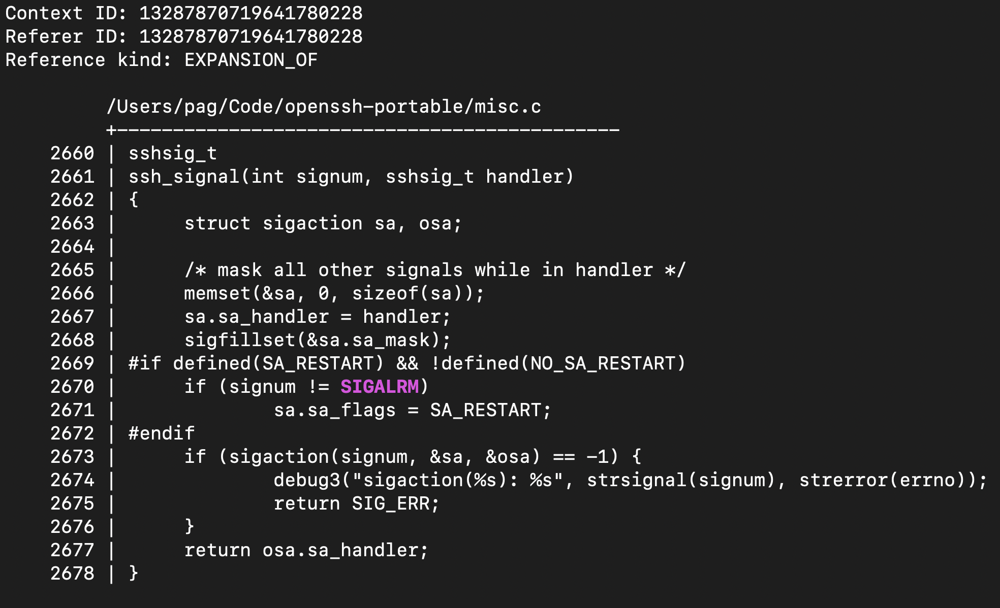
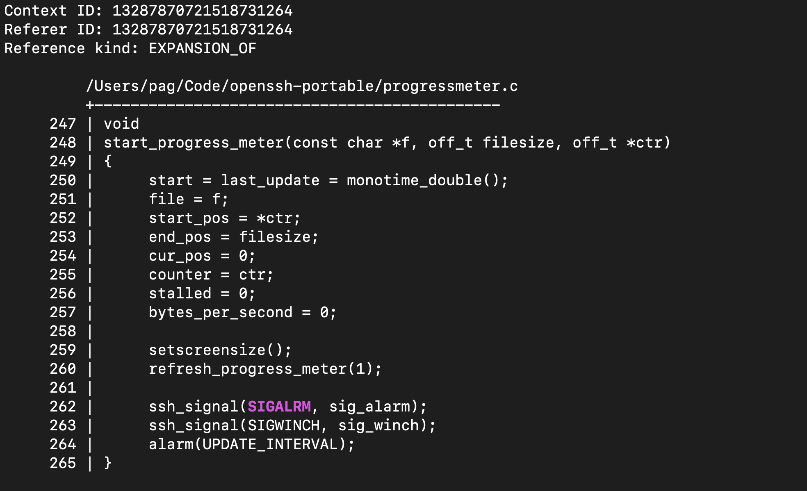
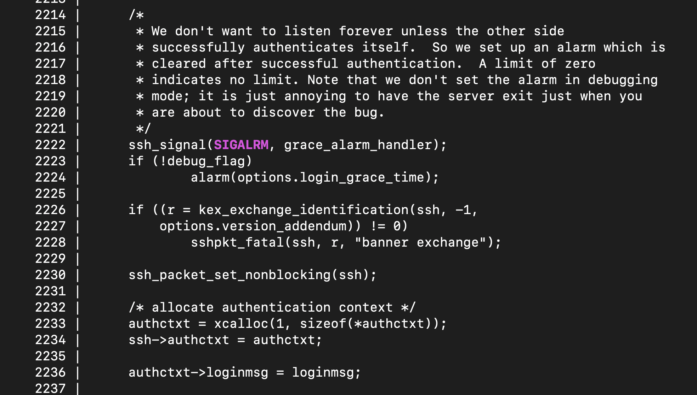

# Variant analysis of CVE-2024-6387

This variant analysis looks for calls to signal-unsafe functions by signal handlers.

## Getting and indexing the code

### Getting the code

```bash
git clone https://github.com/openssh/openssh-portable.git
cd openssh-portable
```

Then, checkout OpenSSH [9.7p1](https://github.com/openssh/openssh-portable/releases/tag/V_9_7_P1:

```bash
git checkout 86bdd3853f4d32c85e295e6216a2fe0953ad93f0
```

### Configuring the build

```bash
autoreconf
CC=`which clang` CXX=`which clang++` ./configure --with-ssl-dir=$HOME/.brew/opt/openssl
```

**Note:** You may need to fiddle with the `configure` invocation. For example, I needed to specify `--with-ssl-dir` on my machine to avoid a `libcrypto` issue.

### Building the code

```bash
mkdir /tmp/clang_compile_commands
CCC_OVERRIDE_OPTIONS="# +-gen-cdb-fragment-path +/tmp/clang_compile_commands " \
make all
```

After this, we should see the following:

```bash
% ls /tmp/clang_compile_commands 
addr.c.5e13.json      fnmatch.c.730f.json     session.c.caa5.json
addrmatch.c.aa04.json     freezero.c.2da8.json      setenv.c.4b9f.json
arc4random.c.ef99.json      getcwd.c.cb71.json      setproctitle.c.9167.json
```

### Indexing the code

Using the [combine_compile_commands.py](../scripts/combine_compile_commands.py) to create a single compilation database for indexing.

```bash
% python3 /path/to/multiplier-checkout/scripts/combine_compile_commands.py /tmp/clang_compile_commands/*.json >compile_commands.json
```

Next, we'll run `mx-index` to index OpenSSH.

```bash
% time ./bin/mx-index --db /tmp/openssh.db --workspace /tmp/openssh.ws --target compile_commands.json --show_progress
Commands                       (237 / 237)           100% [||||||||||||||||||||||||||||||||||||||||]
Evaluated commands             (237 / 237)           100% [||||||||||||||||||||||||||||||||||||||||]
Parsing                        (237 / 237)           100% [||||||||||||||||||||||||||||||||||||||||]
File serialization             (663 / 663)           100% [||||||||||||||||||||||||||||||||||||||||]
AST partitioning               (237 / 237)           100% [||||||||||||||||||||||||||||||||||||||||]
Fragment serialization         (30601 / 30601)       100% [||||||||||||||||||||||||||||||||||||||||]
Type serialization             (18416 / 18416)       100% [||||||||||||||||||||||||||||||||||||||||]
SourceIR                       (  0 / 237)             0% [                                        ]

mx-index --db /tmp/openssh.db --workspace /tmp/openssh.ws --target    246.65s user 48.49s system 523% cpu 56.417 total
```

Here we told `mx-index` to save its database to `/tmp/openssh.db` (we'll need this soon), and its temporary workspace to the directory `/tmp/openssh.ws`. We can now delete `/tmp/openssh.ws`, as its only needed if we wanted to index additional projects into the same database.

```bash
rm -rf /tmp/openssh.ws
```

## Manually finding the issue

The [description](https://www.qualys.com/2024/07/01/cve-2024-6387/regresshion.txt) of regreSSHion states:

> The `SIGALRM` handler of this OpenSSH version calls `packet_close()`, which calls `buffer_free()`, which calls `xfree()` and hence `free()`, which is not async-signal-safe.

We'll start by checking this with the test tools provided in the SDK. This is not the actual way I would recommend doing anything, as these tools are designed as examples of how to use the API, as well as functionality tests of the API -- they are not designed specifically for productivity or composition.

We'll start by trying to understand the specific `SIGALRM` signal. First, lets locate the entity:

```bash
% mx-find-symbol --db /tmp/openssh.db --name SIGALRM --exact
1152921504606847020 2305843009214760458 13314892317121839104  SIGALRM DEFINE_DIRECTIVE
```

The third id, `13314892317121839104`, is the entity ID of `SIGALRM`. Next, lets go and find all uses of `SIGALRM`:

```bash
% mx-highlight-references --db /tmp/openssh.db --entity_id 13314892317121839104
```

The first reference looks like this:



So this says there's a function, `ssh_signal`, taking in a signal number `signum` and a signal handler `handler`, and it attaches `handler` to the `signum` using `sigaction`. In some other uses, we see a handler `sig_alarm` and `grace_alarm_handler` registered for `SIGALRM` via `ssh_signal`: 




So next we can look for paths between `sig_alarm` or `grace_alarm_handler` and a async signal unsafe function, such as `free`.

First, we'll find `free`:

```bash
% mx-find-symbol --db /tmp/openssh.db --name free --exact
1152921504606847195 2305843009214751135 9475573625012617216 free  FUNCTION
```

The third number, `9475573625012617216`, is the entity ID of `free`. Now lets
look for `sig_alarm` and `grace_alarm_handler`:

```bash
% mx-find-symbol --db /tmp/openssh.db --name sig_alarm --exact
1152921504606847411 2305843009214762518 9281918852971626496 sig_alarm FUNCTION
1152921504606847411 2305843009214762498 9475573636927586304 sig_alarm FUNCTION
```

There are two of them, so one is probably a definition and the other is probably a declaration. We can choose
the entity ID of either of them.

```bash
% mx-find-symbol --db /tmp/openssh.db --name grace_alarm_handler --exact
1152921504606847515 2305843009214768730 9281918859485380608 grace_alarm_handler FUNCTION
```

Next, lets see if we can find a path from `sig_alarm` or `grace_alarm_handler` to `free`:

```bash
% mx-print-call-graph --db /tmp/openssh.db --entity_id 9475573625012617216 --reachable_from_entity_id 9281918852971626496 >/tmp/sig_alarm_to_free.dot
```

```bash
% mx-print-call-graph --db /tmp/openssh.db --entity_id 9475573625012617216 --reachable_from_entity_id 9281918859485380608 >/tmp/grace_alarm_handler_to_free.dot
```

This creates the call graphs of `free` rooted at `sig_alarm` and `grace_alarm_handler`, respectively. The output of the `mx-print-call-graph` is a [DOT digraph](https://graphviz.org/doc/info/lang.html). There are no edges in the `sig_alarm` to `free` graph, so we'll focus on the `grace_alarm_handler` to `free` graph:

```bash
% xdot /tmp/grace_alarm_handler_to_free.dot
```

With output looking like this:


We can see that from `grace_alarm_handler`, we can reach `sshfata` via `xmalloc` or `get_sock_port`, and from there `cleanup_exit` provides paths to `free`.

We have now manually confirmed the rough reachability details of the CVE, i.e. that an async-signal unsafe function can potentially be invoked by a signal handler in OpenSSH.
