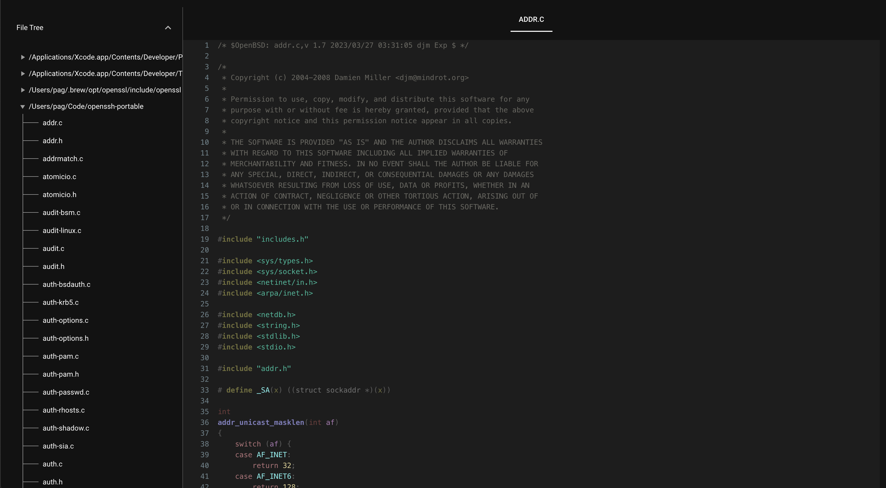
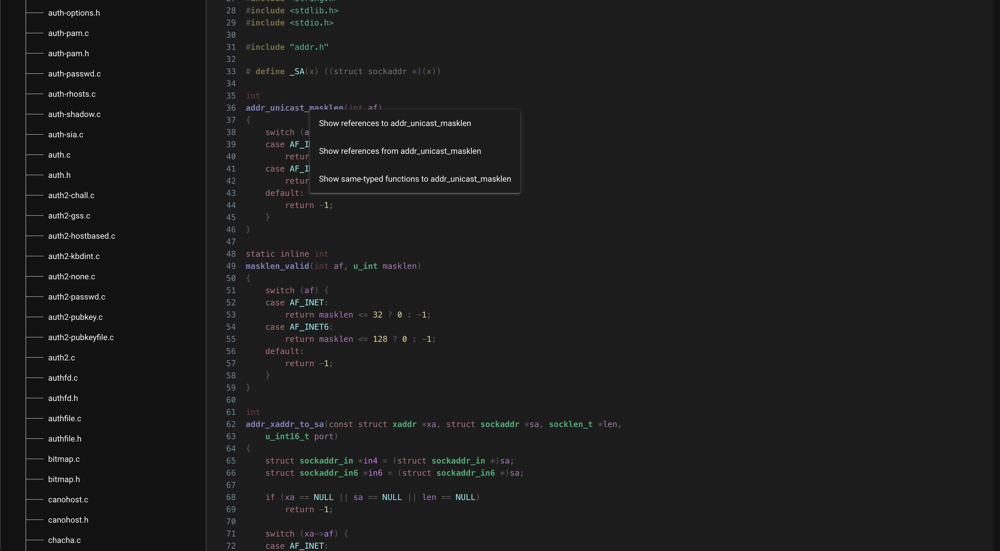
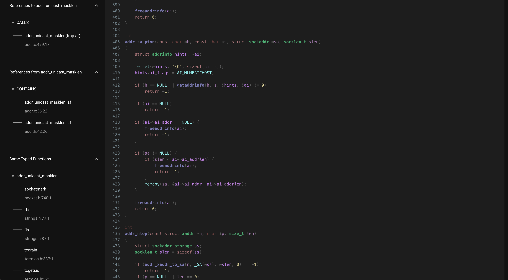

# Web browser

[WebBrowser.py](../bin/Examples/WebBrowser.py) implements a
[NiceGUI](https://nicegui.io/)-based web interface to browse code and references
from an indexed database. The web browser also implements a feature [requested](https://x.com/eatonphil/status/1821573274582823247)
by Phil Eaton: being able to quickly find functions that share the same function signature.
The underlying analysis for finding same-typed functions is its own [tool](group-functions.md).

To run the web browser, first install NiceGUI using `pip install nicegui`. Then:

```shell
python /path/to/multiplier/checkout/bin/Examples/WebBrowser.py --db /tmp/openssh.db 
```

Using and indexed OpenSSH as an example, here is what the web browser looks like
when it is opened. The user is first presented with an file tree view, which
expands to show all files in the indexed database:


When a directory is expanded and a file clicked on, a syntax-highlighted form of
the code of that file is shown.



References are both clickable, triggering redirects to their definitions
(if present), and right-clickable, showing an selection of options:



Clicking each of the right click menu options for the `addr_unicast_masklen` function
shows the following for references to, references from, and same-typed functions:

